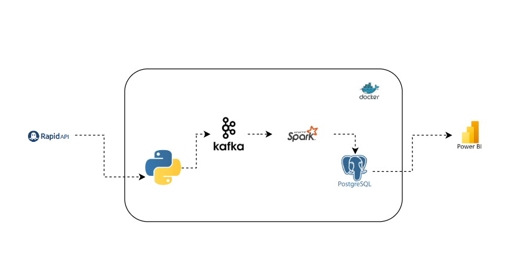
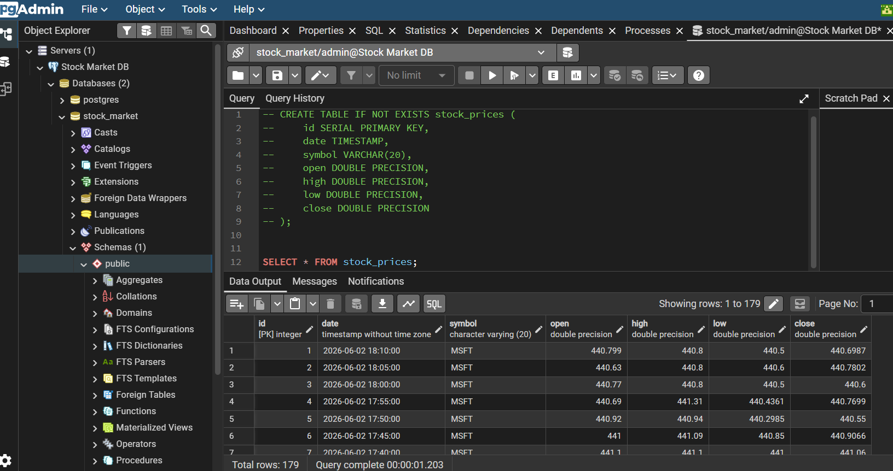

# Real-Time Stock Market Insights

## Overview

Real-Time Stock Market Insights is an end-to-end streaming data engineering project designed to demonstrate modern data engineering concepts and tools.

The project extracts real-time stock market data from the Alpha Vantage API, streams the data through Apache Kafka, processes the data using Apache Spark Structured Streaming, stores the results in PostgreSQL, and prepares the data for future reporting and visualization in Power BI.

This project was built to gain hands-on experience with distributed systems, streaming pipelines, containerization, and real-time data processing.

---

## Project Architecture

The diagram below illustrates the end-to-end architecture of the project.



### Data Flow

1. Python extracts stock market data from the Alpha Vantage API.
2. The Kafka Producer publishes stock events to the Kafka topic `stock_analysis`.
3. Apache Kafka acts as the streaming layer for real-time ingestion.
4. Apache Spark Structured Streaming subscribes to the Kafka topic.
5. Spark processes and transforms incoming stock records.
6. Processed records are written to PostgreSQL using JDBC.
7. PostgreSQL serves as the analytical database for future Power BI reporting and dashboard development.

---

## Technologies Used

* Python
* Apache Kafka
* Apache Spark Structured Streaming
* PostgreSQL
* Docker
* Docker Compose
* pgAdmin
* Power BI
* Requests Library
* Git
* GitHub
* VS Code
* Windows

---

## Project Structure

```text
REAL_TIME_STOCK_MARKET_INSIGHTS/

REAL_TIME_STOCK_MARKET_INSIGHTS/
│
├── Producer/
├── Consumer/
├── images/
│   ├── architecture.png
│   ├── kafka_ui.png
│   └── postgres_results.png
├── README.md
├── compose.yml
└── requirements.txt
```

---

## Key Accomplishments

* Built a real-time stock market data pipeline using Python, Kafka, Spark Structured Streaming, and PostgreSQL.
* Implemented API integration with Alpha Vantage to extract stock market data.
* Configured Apache Kafka as the streaming platform for real-time data ingestion.
* Developed a Spark Structured Streaming consumer to process stock market events.
* Persisted streaming data into PostgreSQL using JDBC integration.
* Containerized all services using Docker and Docker Compose.
* Successfully streamed and stored live stock market data records in PostgreSQL.
* Designed a scalable architecture that supports future reporting and analytics in Power BI.

---

## Features

* Real-time stock market data ingestion
* Kafka streaming architecture
* Spark Structured Streaming processing
* PostgreSQL data storage
* Dockerized deployment
* Scalable architecture
* Future Power BI integration
* Beginner-friendly data engineering project

---

## Setup Instructions

### Clone the Repository

```bash
git clone <repository-url>
cd REAL_TIME_STOCK_MARKET_INSIGHTS
```

### Create a Virtual Environment

```bash
python -m venv venv
```

### Activate the Virtual Environment

Windows:

```bash
venv\Scripts\activate
```

### Install Dependencies

```bash
pip install -r requirements.txt
```

### Configure Environment Variables

Create a `.env` file:

```text
API_KEY=your_api_key_here
```

---

## Running the Project

### Start Docker Services

```bash
docker compose up --build
```

### Stop Docker Services

```bash
docker compose down
```

---

## Docker Services

### Python Producer

Responsible for extracting stock market data and publishing messages to Kafka.

### Apache Kafka

Acts as the streaming platform for real-time message delivery.

### Apache Spark

Processes and transforms streaming stock market data.

### PostgreSQL

Stores processed stock market records.

### pgAdmin

Provides a graphical interface for managing PostgreSQL.

---

## Sample Streaming Output

```text
+-------------------+------+------+--------+-------+------+
|date               |high  |low   |open    |close  |symbol|
+-------------------+------+------+--------+-------+------+
|2026-06-02 15:40:00|423.66|420.94|421.0632|422.569|TSLA  |
+-------------------+------+------+--------+-------+------+
```

---

## PostgreSQL Results

The processed stock market data is successfully stored in PostgreSQL through Spark Structured Streaming.

Example query:

```sql
SELECT * FROM stock_prices;
```

Sample result:

| Symbol | Open     | High   | Low    | Close   |
| ------ | -------- | ------ | ------ | ------- |
| TSLA   | 421.0632 | 423.66 | 420.94 | 422.569 |




---

## Challenges Solved

During the development of this project, several real-world data engineering challenges were addressed, including:

* Kafka broker connectivity issues
* Docker networking configuration
* Spark Worker registration
* Kafka topic management
* Schema and data type conversion
* Spark Structured Streaming checkpoints
* PostgreSQL JDBC integration
* Container orchestration with Docker Compose

These troubleshooting experiences provided valuable hands-on exposure to real-world data engineering workflows.

---

## Future Improvements

Future enhancements may include:

* Additional stock market APIs
* Historical data storage and analysis
* Apache Airflow orchestration
* Cloud deployment (AWS, Azure, or GCP)
* Data quality monitoring
* Logging and alerting
* Power BI dashboards and analytics
* CI/CD implementation using GitHub Actions

---

## Results

Successfully implemented an end-to-end real-time streaming data pipeline using Python, Apache Kafka, Apache Spark Structured Streaming, PostgreSQL, and Docker.

The solution continuously ingests stock market data, processes streaming events, and stores them in PostgreSQL for future analytics and reporting.

---

## Author

**Igho Ogbobine**

Manager, Data Operations | Data Engineering Enthusiast

GitHub: @PixieSteph

---

## About

This project demonstrates the implementation of a real-time data engineering pipeline using Python, Kafka, Spark Structured Streaming, PostgreSQL, Docker, and Power BI.
